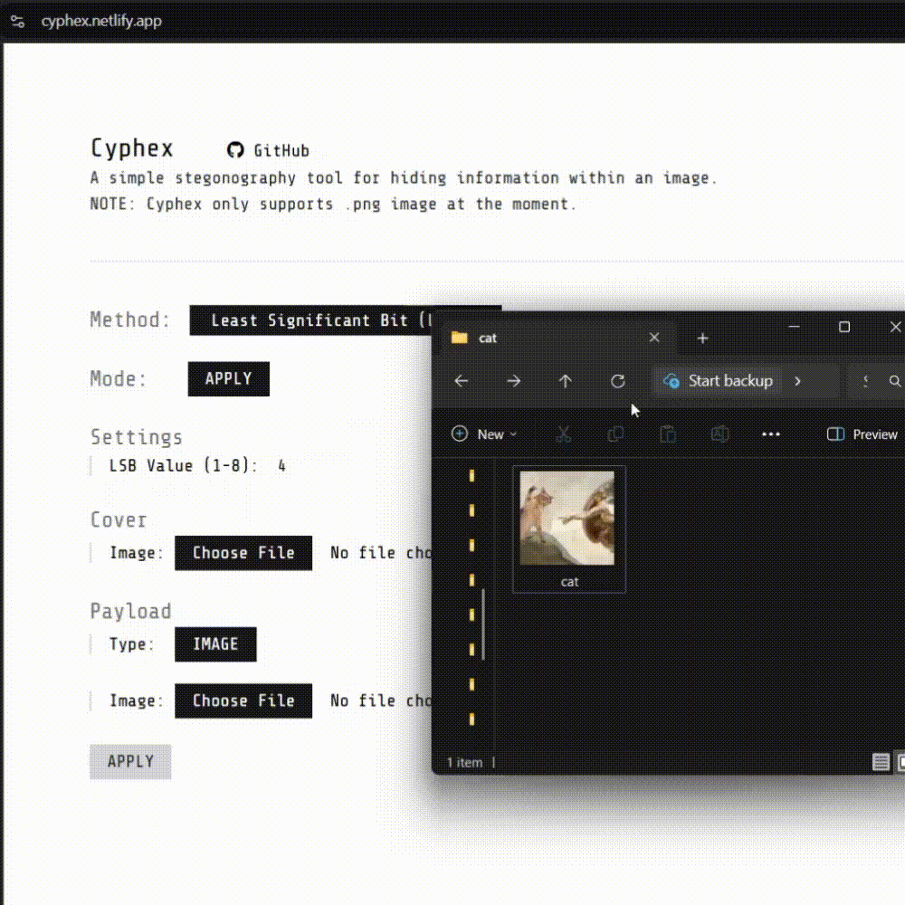

# Cyphex

A simple steganography tool for hiding information within an image. 

[Live demo](https://cyphex.netlify.app/)

PS: The goal of this project is to try out the pipeline oriented programming, a functional programming approach for building scalable end-to-end systems. It is inspired by a talk by Scott Wlaschin: [Railway oriented programming](https://fsharpforfunandprofit.com/rop/). Also, a big thanks to Professor Andrew Rudder for introducing and explaining the concept of stegonography.
